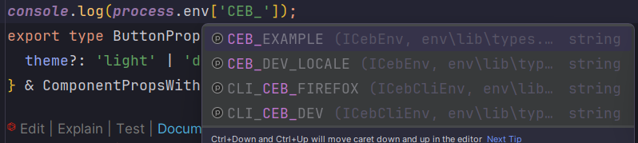

# Environment Package

This package contains code which creates env values.
To use the code in the package, you need to follow those steps:

1. Add a new record to `.env` (NEED TO CONTAIN `CEB_` PREFIX),

    - If you want via cli:
    - Add it as argument like: `pnpm set-global-env CLI_CEB_NEXT_VALUE=new_data ...` (NEED TO CONTAIN `CLI_CEB_` PREFIX)

   > [!IMPORTANT]
   > `CLI_CEB_DEV` and `CLI_CEB_FIREFOX` are `false` by default \
   > All CLI values are overwriting in each call, that's mean you'll have access to values from current script run only.

    - If you want dynamic variables go to `lib/index.ts` and edit `dynamicEnvValues` object.

2. Use it, for example:
    ```ts
    console.log(process.env['CEB_EXAMPLE']);
    ```
   or
   ```ts
   console.log(process.env.CEB_EXAMPLE);
   ```
   but with first solution, autofill should work for IDE:
   
3. You are also able to import const like `IS_DEV` from `@extension/env` like:
   ```ts
    import { IS_DEV } from '@extension/env';
    ```
   For more look [ENV CONST](lib/const.ts)